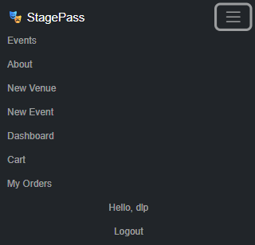
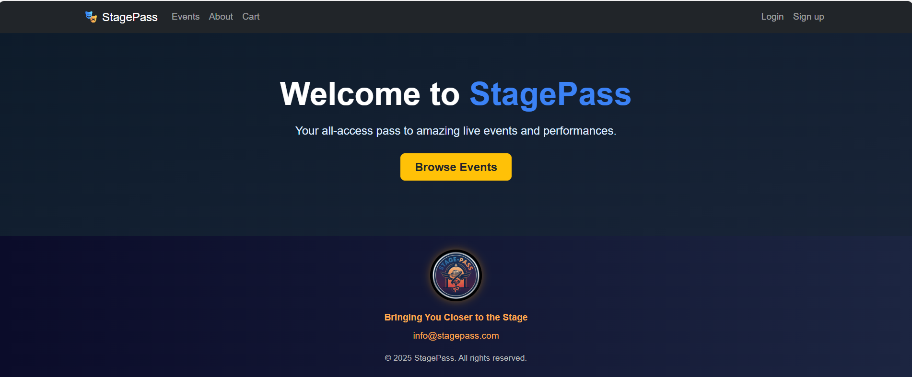
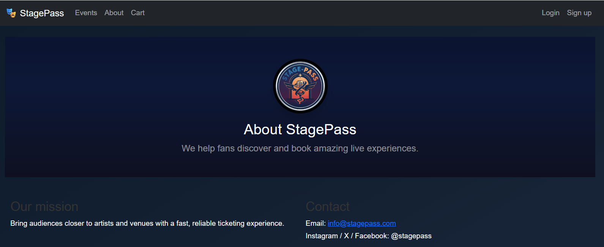
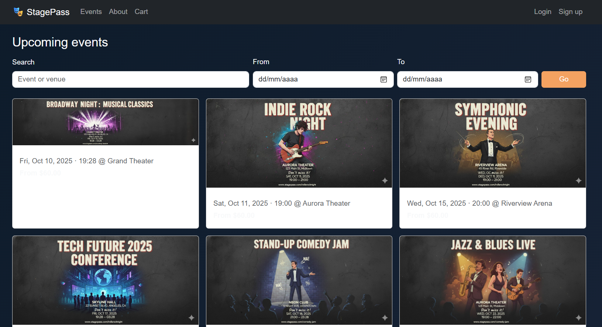
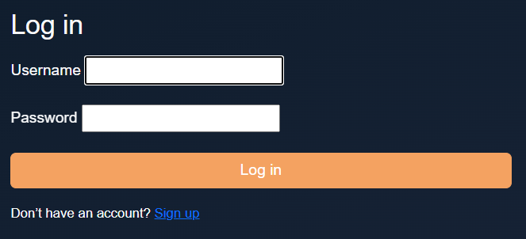
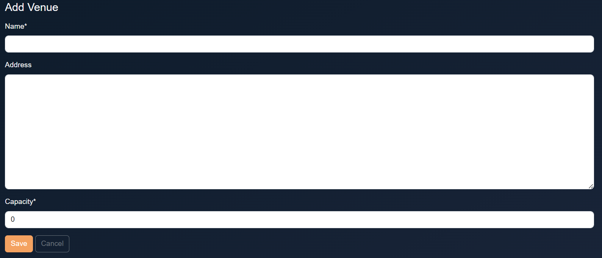
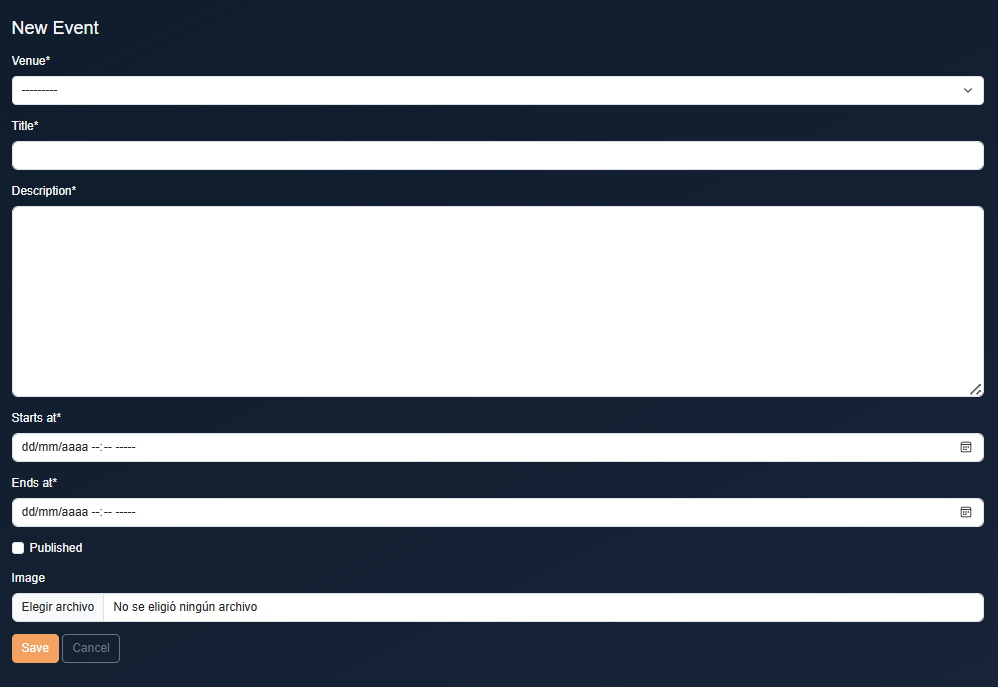
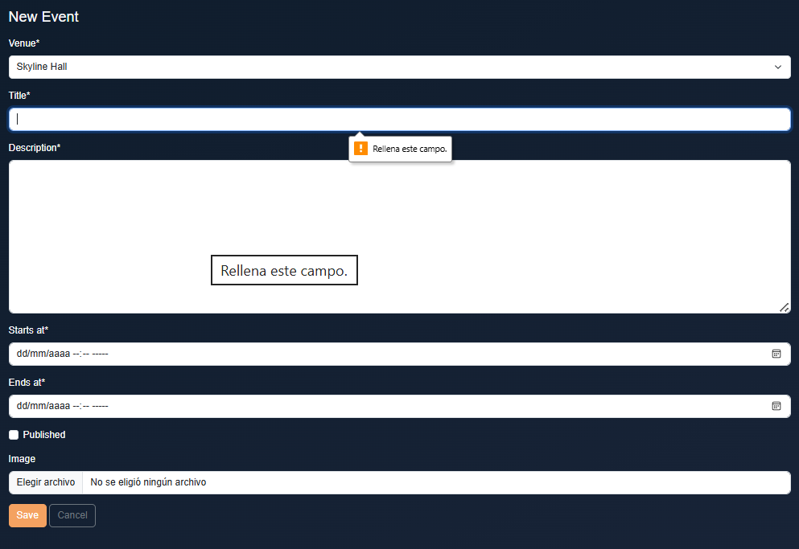
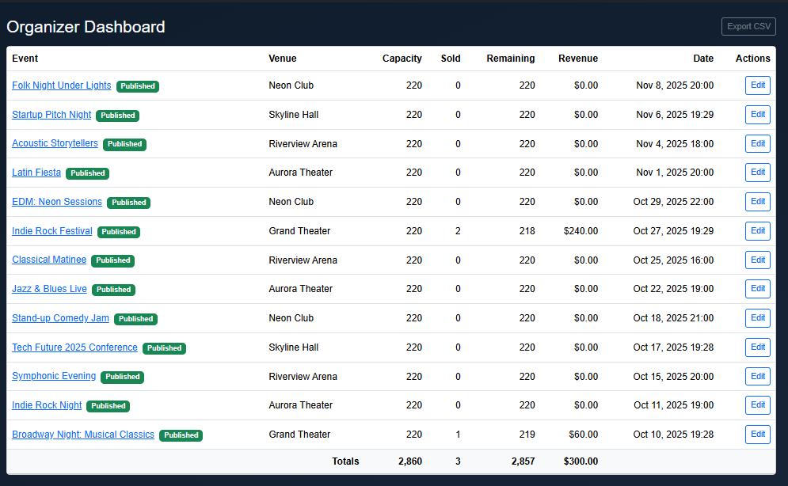

# 🎟️ StagePass — Event Management & Ticketing Platform

StagePass is a full-stack event management and ticketing web application built using Django, Python, HTML, CSS, and JavaScript.
It allows users to discover, organize, and purchase tickets for live events such as concerts, plays, and performances.

The platform supports secure authentication, event creation for organizers, ticket management, and an integrated dashboard for event statistics. StagePass was designed to serve as a digital gateway between audiences and live entertainment, starting with Teatro Bruma and expanding to other venues.

[Visit StagePass Here:](https://stage-pass-ad78e3e8693f.herokuapp.com/)
---
## Table of contents

- [UX](#user-expreience)
- [Design](#design)
- [Features](#features)
- [Testing](#testing)
- [Technologies used](#technologies-used)
- [Deployment](#deployment)
- [Credits](#credits)

## User Expreience
---
### Strategy Plane

StagePass is designed as both a Business-to-Consumer (B2C) and Business-to-Business (B2B) web platform for managing and attending live events.

- For attendees: make it easy to find, browse, and purchase event tickets.
- For organizers: provide a streamlined way to create and manage events, ticket types, and view sales statistics.
- For venues: increase visibility and simplify event hosting logistics through centralized digital tools.

### Audience

- Theater lovers, music fans, and art enthusiasts looking for upcoming events.
- Small and medium-sized venues seeking a reliable ticketing platform.
- Event organizers who need tools to publish, edit, and track their performances.

### User Goals

- Browse all upcoming shows and filter them by venue or date.
- View detailed event pages with descriptions, venues, and ticket tiers.
- Add tickets to a cart and complete checkout securely.
- Manage personal accounts, orders, and ticket history.
- For organizers: easily create, update, and delete events.

### Business Goals

- Provide a seamless platform to digitize live event sales.
- Promote Teatro Bruma and other venues through an elegant digital experience.
- Build brand trust with secure transactions and reliable performance.
- Encourage repeat customers through personalized recommendations and saved accounts.

## Design 
---

### Color Scheme
The color scheme of the StagePass website was designed to convey a sleek, professional look while emphasizing excitement and accessibility. The primary colors are deep navy and bright blue, representing trust and creativity. The accent color, a vibrant golden yellow, is used for call-to-action elements like buttons to attract user attention. A warm orange hue is used sparingly to highlight key text, while neutral tones of gray and off-white balance the overall visual presentation.

This combination of dark backgrounds with bright highlights helps the site feel dynamic and engaging, while ensuring readability and strong contrast across different devices.

### Typography

The StagePass interface combines Poppins and Open Sans for a modern and accessible design aesthetic.

- Headings: Poppins — chosen for its clean, geometric lines that give a theatrical yet professional feel.
- Body Text: Open Sans — used for its excellent readability and balance between elegance and simplicity.

This careful pairing reinforces the StagePass brand as both modern and trustworthy, suitable for representing live event management and ticketing in the arts and entertainment industry.

### Imagery 

The visual identity of StagePass blends real-world event photography with custom AI-generated graphics to create a polished and engaging aesthetic.

All flyers, banners, and the official StagePass logo were designed using Gemini, Google’s generative AI tool. These assets were created to reflect the platform’s theatrical and musical focus — featuring vivid stage lighting, instruments, and audience energy to immerse users in the atmosphere of live performance.

### Agile Methodology 

Agile project management principles guided the development of StagePass, ensuring continuous iteration and collaboration throughout its lifecycle.
GitHub Projects was utilized as the primary project management tool, leveraging a Kanban-style board to track user stories, tasks, and bug fixes.

Development followed short, goal-oriented sprints focusing on:

- Implementing core event management and ticketing features.

- Testing user flows such as registration, checkout, and dashboard analytics.

- Iteratively refining the UI for a seamless user experience.

Each commit and pull request represented a measurable improvement toward the final product, ensuring transparency and adaptability.
User stories were documented and prioritized by importance, allowing clear traceability between requirements, implementation, and testing.

### Wireframes

- The wireframes can be found here: [Wireframes](/docs/images/wireframes/)

### Database schema

The StagePass database schema was designed to follow a clean, relational structure optimized for performance and scalability.
It connects the four core concepts of the platform: venues, events, tickets, and orders.

- **Venue** acts as the foundational model, representing physical locations where events are held.
Each venue can host multiple events, ensuring reusability and consistency across the platform.

- **Event** represents individual concerts, plays, or performances.
It includes metadata such as title, description, schedule, and a slug for SEO-friendly URLs.
Every event links back to a venue and can have multiple ticket tiers.

- **TicketType** defines the available purchase options per event — for example, VIP and General Admission.
Each ticket type has its own price, capacity, and per-user limit. This separation makes it easy to handle different pricing structures and availability.

- **Order** represents a purchase made by a registered user (auth.User).
Orders can be pending, paid, or canceled, and are timestamped to support order history and reporting.

- **OrderItem** functions as the bridge between orders and ticket types.
It stores the quantity and price of each ticket purchased, ensuring order integrity even if ticket prices change later.

This schema design enables efficient data aggregation for features like event dashboards, ticket availability tracking, and revenue analytics.

## Features

### Navbar

- On large screens, the navbar display links to home, About Us, Contact and User Options

- When the user is not logged in, you can login or sign up

- When the user is logged in, says "Hello, dlp(username)" and the option to Logout.

- In small screens, all links are placed within a burger menu.

### Footer

- Users can see the logo of stagepass, slogan and the corporate email.

### Home page

- The initial page contains a welcome message with a link to the events, about and cart pages.

### About 

- This is an informational page that gives an overview of StagePass, describing what the platform does and its mission.

### Events 

- This page displays a list of upcoming events available on StagePass.
- It allows users to search for events or venues, and filter results by date range using the “From” and “To” fields.
- Each event card shows key details like the event name, date, time, venue, and ticket price, helping users easily browse and choose experiences to attend.

### Event Management

- When logged in as a superuser or the event owner, this page allows users to edit, delete, or add a venue directly from the event details section.

### Event Details

- This page provides detailed information about a specific event, including the event title, date, time, and location.
- It features an event image and a short description of what the event is about.
- On the side, users can view ticket tiers (such as VIP or General), see prices and availability, and add tickets to their cart for purchase

### Login 

- This page lets users access their StagePass account by entering their username and password, with a link to sign up if they don’t have one.

- This page alerts users when required fields are left empty, displaying an error message prompting them to enter both their username and password before logging in.

### Sign Up

- This page allows new users to create a StagePass account by entering a username, email, password, and confirming their password before signing up.

### Add Venue 

- This page allows users to add a new venue by entering its name, address, and capacity, with options to save or cancel the entry.

### New Event 

- This page allows users to create a new event by selecting a venue, adding a title, description, start and end times, and optionally uploading an image before saving or canceling

- This page allows users to create a new event by filling out all required fields, including venue, title, description, and event dates. It verifies that the start and end dates are after the current date, the title cannot be empty (""), and that all required fields must be completed, while the image upload is optional.

### Organizer Dashboard

- This page displays a list of all events created by the organizer, showing details such as venue, capacity, tickets sold, remaining seats, revenue, and event date. It also allows users to edit events, and provides an option to export the data as a CSV file.

### Cart

- This page shows the tickets a user has selected, including the event name, ticket type, price, and quantity. Users can update quantities, remove tickets, and proceed to checkout to complete their purchase.

### My orders

- This page lists the user’s completed purchases, showing order numbers, dates, payment status, event details, ticket types, quantities, and total amounts paid.

## Testing 

### Methodology 

Testing formed a crucial part of the StagePass development process, ensuring that each component of the platform functioned as intended and provided a seamless user experience. The process involved a combination of manual and automated testing to validate both frontend and backend operations.

During development, Django’s built-in debug tools and print statements were utilized to monitor data flow, verify form submissions, and ensure correct database interactions. Each feature — such as event creation, ticket purchasing, and user authentication — underwent iterative testing throughout its implementation.

Additionally, manual user scenario testing was performed to replicate real-world use cases, focusing on navigation, input validation, and error handling. This approach helped identify and resolve issues early, guaranteeing that all user stories and acceptance criteria were met before deployment.

#### Home page

| Testing  | Steps | Expected Outcome | Results |  
| - | - | - | - |
| Navigation bar functionality (user not authenticated) | Click all available links | User is directed respectively to the event, about, cart, login or registration links | PASS |
| Navigation bar functionality (user authenticated) | Click all available links | User is directed respectively to the navbar links and has the correct account links (New Venue, New Event, Dashboard, Cart My Rrders) | PASS |
| Footer links | Click all available links | User is directed respectively to all social media links with  | PASS |
| Home page links | Click event link | User is directed respectively to the event page  | PASS |

#### About us page

| Testing  | Steps | Expected Outcome | Results |  
| - | - | - | - |
| Navigation bar functionality (user not authenticated) | Click all available links | User is directed respectively to the event, about, cart, login or registration links | PASS |
| Navigation bar functionality (user authenticated) | Click all available links | User is directed respectively to the navbar links and has the correct account links (New Venue, New Event, Dashboard, Cart My Rrders) | PASS |

#### Events

| Testing                         | Steps                                                                                | Expected Outcome                                                         | Results |
| ------------------------------- | ------------------------------------------------------------------------------------ | ------------------------------------------------------------------------ | ------- |
| Search by keyword               | Type a full event name (e.g., “Indie Rock”).                                         | Only matching cards remain; count reflects filtered set.                 | PASS    |
| Search partial match            | Type a partial term (e.g., “rock”).                                                  | Fuzzy matches shown (case-insensitive).                                  | PASS    |
| Search no results               | Enter a nonsense term.                                                               | “No events found” (or equivalent) message appears; grid is empty.        | PASS    |
| Clear search                    | Remove text from the search box.                                                     | Full event list is restored.                                             | PASS    |
| Date filter – From only         | Set **From** to a date before some events. Click **Go**.                             | Only events on/after the **From** date are shown.                        | PASS    |
| Date filter – To only           | Set **To** to a date before some events. Click **Go**.                               | Only events on/before the **To** date are shown.                         | PASS    |
| Date filter – range             | Set **From** < **To** covering a subset. Click **Go**.                               | Only events within the range appear; others are hidden.                  | PASS    |
| Date validation – From > To     | Set **From** later than **To** and click **Go**.                                     | Validation error or sane fallback (no results & helpful message).        | PASS    |
| Date input format               | Type an invalid date (e.g., `32/13/2025`).                                           | Field prevents submission or shows clear validation error.               | PASS    |
| Apply with Enter key            | Focus any filter field and press **Enter**.                                          | Same behavior as clicking **Go** (filters applied).                      | PASS    |
| Reset filters                   | Clear search and dates, then apply.                                                  | Full, unfiltered list returns.                                           | PASS    |
| Pagination – next               | Click **Next** on page 1.                                                            | Moves to page 2; new set of cards loads.                                 | PASS    |
| Pagination – prev               | From page 2, click **Prev**.                                                         | Returns to page 1; controls update correctly (disabled state on bounds). | PASS    |
| Pagination – boundary           | On the last page, **Next** is disabled; on the first page, **Prev** is disabled.     | Controls reflect boundaries accurately.                                  | PASS    |
| Card content                    | Each card shows image, title, date+time, and venue.                                  | All required fields present and formatted consistently.                  | PASS    |
| Card clickthrough               | Click a card.                                                                        | Navigates to event-detail page for that event.                           | PASS    |
| Price/CTA visibility            | If price/CTA is used, verify presence/formatting (e.g., “From $x.xx”).               | Prices/CTAs render where expected and match event data.                  | PASS    |
| Timezone/format                 | Verify date/time format matches site convention (e.g., `Sat, Oct 11, 2025 · 19:00`). | Uniform formatting across cards and details.                             | PASS    |
| Empty state – date range        | Choose a range with no events.                                                       | Clear empty-state message with suggestion to adjust filters.             | PASS    |
| Layout responsiveness           | Resize to mobile/tablet/desktop.                                                     | Grid reflows without overlap; controls remain usable.                    | PASS    |
| Accessibility – keyboard        | Tab through search, dates, Go, pagination, and cards.                                | Visible focus ring; actions are keyboard-operable.                       | PASS    |
| Accessibility – images          | Inspect card images.                                                                 | Meaningful `alt` text exists or decorative images are hidden from AT.    | PASS    |
| URL persistence (if applicable) | Apply filters, copy URL, open in new tab.                                            | Same filtered results load from the shared URL.                          | PASS    |
| Performance                     | First load and page change render within acceptable time.                            | Smooth scrolling; no obvious layout shifts.                              | PASS    |

#### Authenticated Pages (Venue, Event, Dashboard, Cart & Orders)

| Testing                         | Steps                                                                                                             | Expected Outcome                                                                                                 | Results |
| ------------------------------- | ----------------------------------------------------------------------------------------------------------------- | ---------------------------------------------------------------------------------------------------------------- | ------- |
| Access control                  | Try accessing any of these pages (`/venue/add`, `/event/new`, `/dashboard`, `/cart`, `/orders`) while logged out. | User is redirected to the login page with a prompt to authenticate.                                              | PASS    |
| Add Venue – form display        | Log in and open **Add Venue**.                                                                                    | Form fields for *Name*, *Address*, and *Capacity* are displayed correctly.                                       | PASS    |
| Add Venue – empty fields        | Submit without filling required fields.                                                                           | Validation error appears for missing *Name* and *Capacity*.                                                      | PASS    |
| Add Venue – invalid capacity    | Enter a negative or non-numeric capacity and submit.                                                              | Validation prevents submission and shows error.                                                                  | PASS    |
| Add Venue – valid submission    | Fill all fields correctly and click **Save**.                                                                     | Venue is successfully added, confirmation message displayed.                                                     | PASS    |
| Add Venue – cancel button       | Click **Cancel**.                                                                                                 | Redirects back to previous page or dashboard without saving.                                                     | PASS    |
| Add Event – form display        | Log in and open **New Event**.                                                                                    | Fields for *Venue*, *Title*, *Description*, *Dates*, *Published*, and *Image* are shown.                         | PASS    |
| Add Event – missing fields      | Submit with required fields empty.                                                                                | Validation messages appear for each required field.                                                              | PASS    |
| Add Event – invalid date        | Enter *End date* before *Start date* and submit.                                                                  | Validation prevents submission, clear error displayed.                                                           | PASS    |
| Add Event – image upload        | Upload an image and save event.                                                                                   | Image is uploaded successfully and displayed on event card.                                                      | PASS    |
| Add Event – published toggle    | Uncheck **Published** and save.                                                                                   | Event is created but hidden from public event listings.                                                          | PASS    |
| Add Event – valid submission    | Complete all fields and click **Save**.                                                                           | Event successfully created, confirmation shown.                                                                  | PASS    |
| Dashboard – table display       | Open **Dashboard** as authenticated organizer.                                                                    | All events are listed with correct columns: Event, Venue, Capacity, Sold, Remaining, Revenue, Date, and Actions. | PASS    |
| Dashboard – edit button         | Click **Edit** on any event.                                                                                      | Event edit page loads pre-filled with current data.                                                              | PASS    |
| Dashboard – export CSV          | Click **Export CSV**.                                                                                             | CSV file downloads successfully containing event data.                                                           | PASS    |
| Cart – empty state              | Access **Cart** with no tickets added.                                                                            | Message “Your cart is empty.” is displayed.                                                                      | PASS    |
| Cart – add item                 | Add an event ticket from Events page.                                                                             | Ticket appears in cart with correct details (type, unit, quantity, total).                                       | PASS    |
| Cart – update quantity          | Change quantity and click **Update**.                                                                             | Total updates correctly; grand total recalculated.                                                               | PASS    |
| Cart – remove item              | Click **Remove**.                                                                                                 | Item is deleted from cart and empty state message appears if no items remain.                                    | PASS    |
| Checkout – button functionality | Click **Checkout** with items in cart.                                                                            | Redirects to checkout or payment confirmation page.                                                              | PASS    |
| Orders – display                | Open **My Orders** after purchase.                                                                                | List of paid orders displayed with details (event name, quantity, total).                                        | PASS    |
| Orders – order detail           | Click on an order number.                                                                                         | Expands or redirects to show detailed ticket info.                                                               | PASS    |
| Logout functionality            | Click **Logout** and attempt to revisit protected pages.                                                          | User is logged out; redirected to login page if trying to access protected routes.                               | PASS    |

#### Login Page

| Testing                               | Steps                                      | Expected Outcome                                                                              | Results |
| ------------------------------------- | ------------------------------------------ | --------------------------------------------------------------------------------------------- | ------- |
| Form display                          | Open **/login**.                           | Username, Password fields and **Log in** button are visible.                                  | PASS    |
| Required fields                       | Submit with both fields empty.             | Validation indicates required fields.                                                         | PASS    |
| Missing password                      | Enter username only and submit.            | Validation indicates password is required.                                                    | PASS    |
| Missing username                      | Enter password only and submit.            | Validation indicates username is required.                                                    | PASS    |
| Invalid credentials                   | Enter an incorrect username/password pair. | Error message shown; user stays on login page.                                                | PASS    |
| Successful login                      | Enter valid credentials and submit.        | User is authenticated and redirected to the default post-login page (e.g., Events/Dashboard). | PASS    |
| Redirect to login from protected page | Visit a protected URL while logged out.    | Redirects to login; after logging in, user returns to the original URL.                       | PASS    |
| Login link visibility                 | From navbar, click **Login**.              | Navigates to /login.                                                                          | PASS    |
| Sign up link on form                  | Click **Sign up** link under the form.     | Navigates to /signup (registration page).                                                     | PASS    |
| Logout flow                           | Log in, then click **Logout**.             | Session ends; protected pages redirect to login.                                              | PASS    |

#### Sign Up page

| Testing                       | Steps                                                              | Expected Outcome                                                                                 | Results |
| ----------------------------- | ------------------------------------------------------------------ | ------------------------------------------------------------------------------------------------ | ------- |
| Form display                  | Open **/signup**.                                                  | Fields for Username, Email, Password, Password confirmation and **Sign up** button are visible.  | PASS    |
| Required fields               | Submit with all fields empty.                                      | Validation indicates required fields.                                                            | PASS    |
| Invalid email                 | Enter an invalid email format and submit.                          | Email field shows a validation error.                                                            | PASS    |
| Short/weak password           | Enter a password that violates policy (e.g., too short or common). | Password policy errors are shown; form not submitted.                                            | PASS    |
| Passwords mismatch            | Enter different values for Password and Confirmation.              | Error indicates passwords must match.                                                            | PASS    |
| Duplicate username            | Use an existing username and submit.                               | Error states username already taken.                                                             | PASS    |
| Duplicate email (if enforced) | Use an email already registered.                                   | Error states email already in use.                                                               | PASS    |
| Successful registration       | Fill all fields with valid, unique data and submit.                | Account is created; user is redirected (e.g., to login or profile setup) with a success message. | PASS    |
| Login link on form            | Click **Log in** link under the form.                              | Navigates to /login.                                                                             | PASS    |
| Authenticated access          | While logged in, visit /signup.                                    | Redirects away (e.g., to home/dashboard) to prevent re-registering.                              | PASS    |

### Testing user stories from UX section
### Testing User Stories from UX Section

As both new and existing users will experience similar workflows — browsing events, creating their own, and purchasing tickets — user stories were grouped according to shared interactions and permissions.

#### All Users

- **Explore Events**

    - Users can browse all published events on the homepage and event listing page.  
    - Each event card includes the title, venue, schedule, and lowest ticket price.  
    - Clicking an event opens a detailed view with ticket tiers and descriptions.

- **Learn About StagePass**

    - The About page explains the platform’s purpose, how ticketing works, and what venues are featured.  
    - Navigation links (**Events**, **About**, **Cart**) are available to all users for easy exploration.

- **Contact or Support**

    - Users can access a Contact or Info section in the footer to learn how to get help or report issues.  
    - For live issues, the support email (**info@stagepass.com**) is provided in the site footer.

- **View Event Details**

    - All visitors — authenticated or not — can see detailed event pages with tier options, pricing, and availability.  
    - Ticket tiers (e.g., VIP, General Admission) display price, remaining seats, and per-user purchase limits.

#### Existing and Future User Goals

- **Create Events (Organizers)**

    - Logged-in users with appropriate permissions can create new events using the **New Event** form.  
    - Upon successful submission, they receive confirmation and see their event appear in the public listings.

- **Edit Events**

    - Organizers can edit details such as the event title, venue, description, and image.  
    - Successful edits trigger confirmation messages via Django’s messaging framework.

- **Delete Events**

    - Event creators or staff members can delete their events directly from the event detail page.  
    - Once deleted, the event and its related ticket tiers are permanently removed from the system.

- **Create Venues**

    - Organizers can add new venues via the **New Venue** form.  
    - Venues are reusable and can host multiple events, allowing for efficient data management.

- **Manage Ticket Tiers**

    - Organizers define multiple ticket tiers for each event (VIP, General, etc.).  
    - Each tier can have its own price, capacity, and per-user limit.

- **Add Tickets to Cart**

    - Registered users can add tickets to their shopping cart, adjusting quantities for each tier.  
    - Ticket availability is automatically reduced as orders are placed.

- **View and Manage Cart**

    - Users can review items in their cart before confirming payment.  
    - If they change their mind, they can remove or adjust quantities before checkout.

- **Checkout / Place Order**

    - Once satisfied, users can complete their order and receive confirmation.  
    - Orders include the event name, selected ticket type(s), quantity, and total cost.

- **Access Dashboard (Staff/Organizers)**

    - Organizers and staff can view statistics on total capacity, sold tickets, remaining seats, and revenue.  
    - A **CSV export** feature allows downloading all event data for reporting purposes.

- **Login**

    - Users can log in to access event management, purchase history, and administrative options.

- **Logout**

    - Authenticated users can securely log out, restricting further access to organizer and personal features.

#### Future User Goals

- **Sign Up**

    - New users can register an account to access additional features such as creating or managing events.

- **Profile Management**

    - In future versions, users will have personal dashboards to view their purchased tickets and event participation.

- **Email Notifications**

    - Planned functionality will include email confirmations for orders and reminders for upcoming events.

### Validator Testing

#### HTML Validation

- The main deployed site URL (`https://stage-pass-ad78e3e8693f.herokuapp.com/`) was tested using the **W3C HTML Validator**.  
- A few minor warnings were reported related to **trailing slashes on void elements**, which have no effect on rendering but can interact badly with unquoted attribute values.  
- One error appeared for a **stray `<script>` tag**, which will be corrected in future updates.  
- Overall, the site structure, meta elements, and HTML syntax validate successfully, with no major issues detected.

#### CSS Validation

- The deployed CSS files were tested through the **W3C CSS Validator** at [https://jigsaw.w3.org/css-validator](https://jigsaw.w3.org/css-validator).  
- **Results:**  
  - Validation returned:  
    > ✅ *Congratulations! No Error Found.*  
  - The document validates successfully under **CSS level 3 + SVG**.  
- No warnings or issues were found, confirming fully compliant CSS.

#### JavaScript Validation

- The JavaScript files were tested using the **JSHint Validator**.    
- All other parts of the script passed validation successfully — no syntax or logic errors were reported.  
- The code adheres to modern ES6 standards and demonstrates consistent indentation and formatting.

#### Python Validation

- All Python view files were checked using the **Code Institute Python Linter (PEP8 online tool)**.  
- Results summary:

  **accounts/views.py**
  - 2 minor style warnings: one missing blank line and one line exceeding 79 characters.

  **events/views.py**
  - Multiple `E501` warnings (lines exceeding 79 characters).  
  - A few formatting and spacing issues such as missing or extra blank lines (`E302`, `E303`, `E306`) and trailing whitespace (`W291`).  
  - Inline comment formatting issues (`E261`, `E262`) also reported.  
  - These are minor PEP8 deviations and do not affect functionality.

  **orders/views.py**
  - Several `E501` warnings for long lines exceeding 79 characters.  
  - Otherwise, no structural or indentation issues found.

- No syntax or logic errors were identified — all files **execute correctly** and meet Django’s functional requirements.

#### Accessibility and Browser Testing

- The page achieved an **excellent Accessibility rating** in Lighthouse.  
- Tested successfully on **Chrome, Firefox, and Safari**, ensuring consistent layout and rendering.  
- No broken links or missing assets detected during testing.

## Technologies Used

### Programming Languages

- **HTML5** — for semantic page structure.  
- **CSS3** — for layout and responsive styling.  
- **JavaScript (ES6)** — for interactive elements and frontend logic.  
- **Python (Django)** — as the main backend framework for handling data models, authentication, and server logic.

---

### Frameworks, Libraries, and Programs Used

- **Bootstrap 5** — for responsive front-end design and layout components.  
- **Google Fonts** — for consistent typography styling across the site.  
- **Font Awesome** — for icons used throughout the navigation and event cards.  
- **Django** — the primary web framework used for backend development and ORM structure.  
- **Django-Allauth** — for authentication, registration, and login management.  
- **Django Cloudinary Storage** — for managing and hosting media files such as images, logos, and flyers.  
- **Pillow** — for image processing and thumbnail management.  
- **Gunicorn** — WSGI HTTP server used for deploying the Django application.  
- **Psycopg2** — PostgreSQL database adapter for Django.  
- **Heroku** — deployment platform for the live version of *StagePass*.  
- **GitHub** — for repository hosting and version control.  
- **GitPod / VS Code** — development environments used throughout the project.  
- **Lucidchart** — used to create the database entity relationship diagram (ERD).  
- **Gemini AI** — used to generate project imagery such as event flyers and logo concepts.  
- **Balsamiq** — for low-fidelity wireframing during the design phase.

---

## 🚀 Deployment

### Deploying the Project on Heroku

1. **Log in** to your [Heroku](https://heroku.com) account and create a new app.  
2. **Choose a region** (e.g., Europe or the United States).  
3. In your project’s root directory, ensure the following files exist:
   - `requirements.txt` — listing all dependencies.  
   - `Procfile` — defining how Gunicorn runs your Django app.  
4. **Connect your GitHub repository** to the Heroku app via the **Deploy** tab.  
5. **Enable Automatic Deploys** for continuous updates on each commit.  
6. **Set the necessary Config Vars** under *Settings → Config Vars*:
   - `SECRET_KEY`  
   - `DATABASE_URL`  
   - `CLOUDINARY_URL`  
   - `DEBUG=False`  
   - `ALLOWED_HOSTS=.herokuapp.com, localhost, 127.0.0.1`  
7. Click **Deploy Branch** to initiate deployment.  
8. Once deployment completes, click **Open App** to view the live site.

---

### Deployment Summary

| Component           | Service Used             | Purpose                                 |
| ------------------- | ------------------------ | --------------------------------------- |
| **Database**        | PostgreSQL (ElephantSQL) | Persistent database storage             |
| **Media Storage**   | Cloudinary               | Image and media file management         |
| **Web Server**      | Gunicorn                 | WSGI HTTP server for Django             |
| **Hosting**         | Heroku                   | Application hosting and CI/CD           |
| **Version Control** | GitHub                   | Repository management and collaboration |

## 🧾 Credits

### 🎨 Design

The overall design of **StagePass** was inspired by modern event management and ticketing platforms such as **Eventbrite**, **Ticketmaster**, and **Dice**.  
The goal was to create a clean, intuitive interface that made event discovery and ticket purchasing effortless for users while maintaining a professional aesthetic for organizers.

The **Bootstrap 5** framework was used extensively to ensure responsiveness and consistent styling across devices.  
Color palettes and font pairings were carefully selected using **Realtime Colors** to achieve visual harmony and enhance readability.

---

### 💻 Code

The project followed **Django’s Model-View-Template (MVT)** architecture, ensuring a clear separation between data, logic, and presentation layers.  
Development decisions were guided by best practices and reliable community resources.

#### Key References and Learning Resources

- [**Django Documentation**](https://docs.djangoproject.com/en/stable/) — for ORM relationships, URL routing, and static file handling.  
- [**Stack Overflow**](https://stackoverflow.com/) — for resolving caching issues, query optimization, and form handling.  
- [**Coding for Entrepreneurs Tutorials**](https://www.codingforentrepreneurs.com/) — for advanced form customization and model relationships.  
- [**Django-Allauth Documentation**](https://django-allauth.readthedocs.io/en/latest/) — for authentication, registration, and login management.

---

### ⚙️ Challenges and Solutions

#### 🧠 Caching and Query Efficiency
To optimize event listings and avoid redundant queries, **Django’s `select_related`** and **`prefetch_related`** methods were used within views.  
This significantly reduced the number of database hits while keeping event and venue data up to date.

#### 🔍 Dynamic Filtering
Implementing advanced search and filtering by **event title, venue, and date** required combining **Q objects** with input sanitization.  
Date filtering was implemented using Python’s `datetime.fromisoformat()` to ensure accurate and reliable handling of date ranges.

#### 📊 Dashboard Aggregations
The **Organizer Dashboard** provides real-time insights into ticket sales, total revenue, and venue capacity.  
This functionality was achieved using **Django ORM aggregation functions** such as `Sum()`, `F()`, and `Coalesce()`.  
These allow data to be computed dynamically without the need for external analytics tools.

#### 📁 CSV Export Functionality
To support reporting and analytics, a **CSV export** feature was added for staff users.  
This allows structured event data—including ticket prices, venues, and schedules—to be exported directly from the admin interface.

#### 🔐 Authentication Flow and Permissions
The platform uses **role-based access control**:
- Event and venue creation is restricted to authenticated organizers.  
- Dashboard analytics and data export tools are available only to staff members.  
This ensures that all critical operations are secured and appropriately scoped by user role.

---

### 🖼️ Media

All media assets — including logos, event flyers, and promotional banners — were generated using **Gemini AI**.  
These visuals were designed to maintain a consistent and professional identity for StagePass and were optimized for performance through **Cloudinary**’s image delivery and compression features.

---

### 📝 Content

All **event names**, **venue descriptions**, and **sample listings** used in the project were generated using **ChatGPT**.  
These served as realistic placeholders for testing and presentation purposes, ensuring that the dataset appeared authentic and cohesive while avoiding any copyrighted or third-party content.

